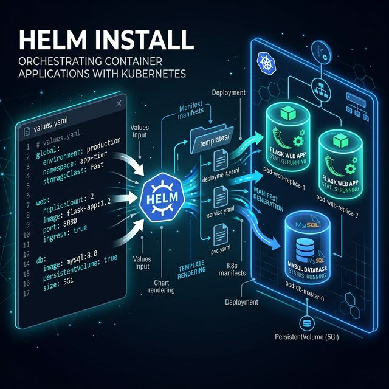

# Two-Tier Web Application (Flask + MySQL)

A modern, scalable Two-Tier web application architecture deployed on Kubernetes via Helm charts.



### 🚀 Dynamic Deployment Flow Animation
I have created two high-quality visualizations for this project:

1.  **Interactive Web Animation**: A full-screen, GSAP-powered dashboard showing the Step-by-Step flow. Open **[index.html](index.html)** in your browser and click "TRIGGER HELM INSTALL".
2.  **Embedded SVG Flow**: A lightweight, pulsing SVG animation that visualizes the data flow from `values.yaml` to the Kubernetes cluster.


- **Values Input**: Shows parameters from `values.yaml` being read.
- **Helm Engine**: Visualizes the template rendering process.
- **K8s Orchestration**: Animates the creation of Flask Web App replicas and the MySQL Database with Persistent Storage.

## Overview

This project consists of two core components:
1.  **Frontend (Flask App)**: A Python-based Flask application providing a user-facing API and interface.
2.  **Backend (MySQL Database)**: A dedicated MySQL database instance for persistent storage.

## Features

- **Kubernetes Ready**: Fully containerized and ready for deployment on any K8s cluster.
- **Helm Guided**: Infrastructure is managed via modular Helm charts.
- **Scalable Architecture**: Support for Horizontal Pod Autoscaling (HPA).
- **Automated Service Management**: Ingress, Service, and ServiceAccount templates included.

## Project Structure

- `flask-app-chart/`: Helm templates for the Flask application.
- `mysql-chart/`: Helm templates for the MySQL database.
- `animation.png`: Project architecture visualization.

## Quick Start

### 1. Prerequisites
- Kubernetes cluster (e.g., Minikube, Kind, Docker Desktop)
- Helm 3+

### 2. Deploy the Flask App
```bash
helm install flask-app ./flask-app-chart
```

### 3. Deploy the MySQL Database
```bash
helm install mysql ./mysql-chart
```

## Troubleshooting

- **CrashLoopBackOff**: If the Flask pod crashes, ensure the `messages` table in the `mydb` database is initialized. 
- **DB Initialization**: To manually create the table:
  ```bash
  kubectl exec <mysql-pod-name> -- mysql -uadmin -padmin mydb -e "CREATE TABLE messages (id INT AUTO_INCREMENT PRIMARY KEY, message TEXT);"
  ```

---
Built with ❤️ for modern infrastructure.
